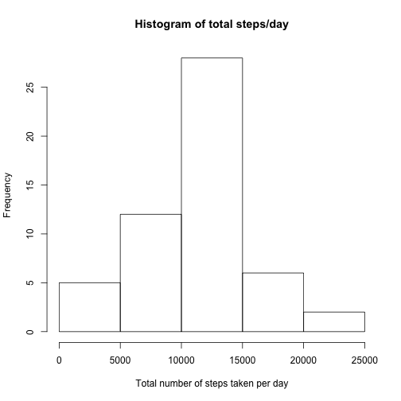
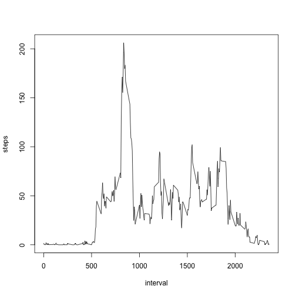
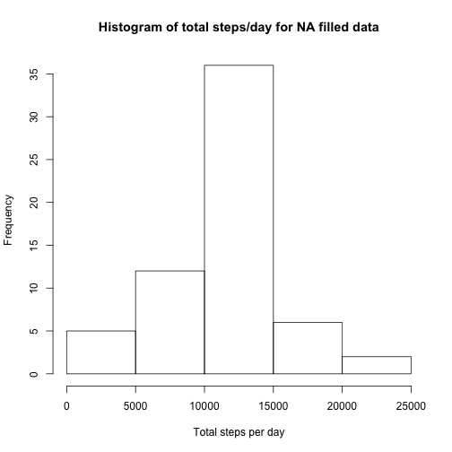
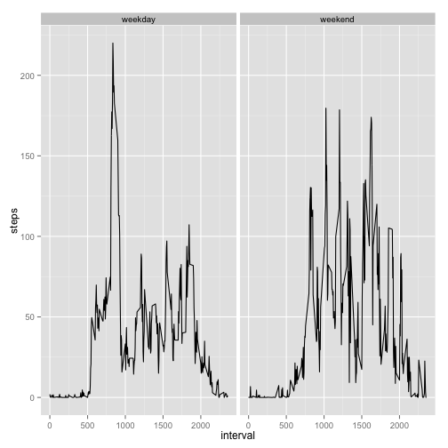

Reproducible Research: Peer Assessment 1
===============================================
output: 
  html_document:
    keep_md: true

## Loading and preprocessing the data.


```r
mydata<-read.csv("activity.csv")
mydata$date<-as.Date(mydata$date, "%Y-%m-%d")
mydata$steps<-as.numeric(mydata$steps)
mydata$interval<-as.numeric(mydata$interval)
```

## What is mean total number of steps taken per day?


```r
library(datasets)
library(dplyr)
by_date<-group_by(mydata,date)
day_sum<-summarize(by_date,sum(steps))
hist(day_sum$"sum(steps)", xlab="Total number of steps taken per day", main= "Histogram of total steps/day")
```

 

```r
mean_day_sum<-mean(day_sum$"sum(steps)", na.rm=T)
median_day_sum<-median(day_sum$"sum(steps)", na.rm=T)
cat ("The mean and median of the total number of steps taken each day are", mean_day_sum, "and", median_day_sum)
```

```
## The mean and median of the total number of steps taken each day are 10766.19 and 10765
```

## What is the average daily activity pattern?


```r
by_interval<-group_by(mydata,interval)
step_by_interval<-summarize(by_interval,steps = mean(steps, na.rm=TRUE))
with(step_by_interval, plot(interval, steps, type="l"))
```

 

```r
max_interval<-step_by_interval[which.max(step_by_interval$steps),1]
max_interval<-as.numeric(max_interval)
cat("Maximum number of steps is in interval", max_interval)
```

```
## Maximum number of steps is in interval 835
```

## Imputing missing values

Calculate and report the total number of missing values in the dataset (i.e. the total number of rows with NAs)


```r
sum_na<-sum(is.na(mydata))
cat("the total number of missing values is", sum_na)
```

```
## the total number of missing values is 2304
```

Filling in all of the missing values in the dataset with the mean for that 5-minute interval. I created a function called "interval2steps" to get the step mean for a particular given interval.


```r
interval2steps<-function(num_interval){
        row_interval<-filter(step_by_interval, interval== num_interval)
        mean4interval<-row_interval$steps
        #mean4interval
        return (mean4interval)
}
```

Create a new dataset called "fdata" that is equal to the original dataset but with the missing data filled in.


```r
fdata<-mydata
counter<-as.numeric #count NAs been filled
counter=0
for (i in 1:nrow(fdata)) {
        if (is.na(fdata[i,]$steps)) {
                fdata[i,]$steps<-interval2steps(fdata[i,]$interval)
                counter = counter+1   
        }               
}
cat("the number of NA has been filled is", counter, "which is equal to the number of NAs in the data set")
```

```
## the number of NA has been filled is 2304 which is equal to the number of NAs in the data set
```

Make a histogram of the total number of steps taken each day and Calculate and report the mean and median total number of steps taken per day. 


```r
fby_date<-group_by(fdata,date)
fday_sum<-summarize(fby_date, sum(steps))
hist(fday_sum$"sum(steps)", xlab="Total steps per day", main="Histogram of total steps/day for NA filled data")
```

 

```r
fmean_day_sum<-mean(fday_sum$"sum(steps)")
fmedian_day_sum<-median(fday_sum$"sum(steps)")
cat ("The mean and median of the total number of steps taken each day for the NA filled data are", fmean_day_sum, "and", fmedian_day_sum)
```

```
## The mean and median of the total number of steps taken each day for the NA filled data are 10766.19 and 10766.19
```

Do these values differ from the estimates from the first part of the assignment? What is the impact of imputing missing data on the estimates of the total daily number of steps?

The shape of the histogram seems similar but the frequency rised a bit. The mean value is the same as before NAs was filled. The median value is slightly different.

## Are there differences in activity patterns between weekdays and weekends?

Dataset with the filled-in missing values (fdata) is used in this part. A new factor variable "wkwknd" was created with two levels – “weekday” and “weekend” indicating whether a given date is a weekday or weekend day.


```r
library(lubridate)
myday<-wday(fdata$date)
for (i in 1:length(myday)){
        if (myday[i] %in% c(1, 0)){
                myday[i]="weekend"
        }
        else {
                myday[i]="weekday"
        }        
}
fdata<-fdata %>% mutate(wkwknd = myday)
fdata$wkwknd<-as.factor(fdata$wkwknd)
```

Make a panel plot containing a time series plot (i.e. type = "l") of the 5-minute interval (x-axis) and the average number of steps taken, averaged across all weekday days or weekend days (y-axis).


```r
library(ggplot2)
fdata <-fdata %>% group_by(wkwknd,interval) %>%
        summarize(steps = mean(steps))
ggplot(fdata, aes(interval, steps)) + geom_line() + facet_grid(.~wkwknd)
```

 


